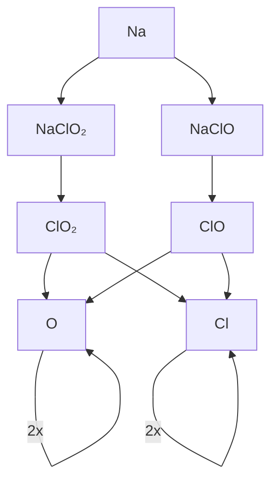

<link rel="stylesheet" type="text/css" href="/assets/css/styles.css">


* mermaid でのグラフ表示

* .md での表示は期待通りなんだが、jekyll で　html 化されると　全然違う結果になるな、、、

||
|-|





* example and [reference](https://guides.github.com/features/mastering-markdown/)

* javascript で リンク入れたら50%表示するタグを作るツールをcodepenで作ったほうがいいな
* 作ったのでトップページに配置した。<< [実験場](https://codepen.io/jamad/pen/RwdNQPv ) 
* `````` 


### Doc
* https://docs.github.com/en/pages/getting-started-with-github-pages


# テーブルの幅固定のsyntax
* `| y/m/d | image |` にて目的を達成。（otherwise, 空白部分で自動的に改行）　


# テーブルの揃えのsyntax

##  [参考](https://kramdown.gettalong.org/syntax.html#tables)

| デフォルトは左詰めと同じ |左詰め | 中央揃え | 右詰め |
|-----------------|:-----------|:---------------:|---------------:|
| First body part |Second cell | Third cell      | fourth cell    |
| Second line     |foo         | **strong**      | baz            |
| Third line      |quux        | baz             | bar            |

```
|-|-|-|-|
|-  |:- |:-:|-: |
|abc|abc|abc|abc|
```

### （メモ）html では　一つのパイプでテーブル作れたけど、.mdのpreview ではテーブルにならないので、通常の表記の方が良いだろう。

A|B

by `A|B`


# 2023-12-28 下記のトレーニングは終了したので archive化しておいた
* [x] https://github.com/skills/communicate-using-markdown
